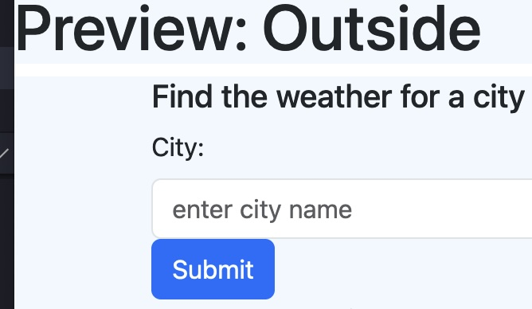

# Check Your Weather

## Description
A demonstration of the use of external API--in this case, https://openweathermap.org/forecast5. The idea is to allow the user to find the weather for a city they chose--current weather information, and a five-day forecast.

## Preview

## Deployment

Deployed to Pages [here](https://mollydotwhat.github.io/checkyourweather/)